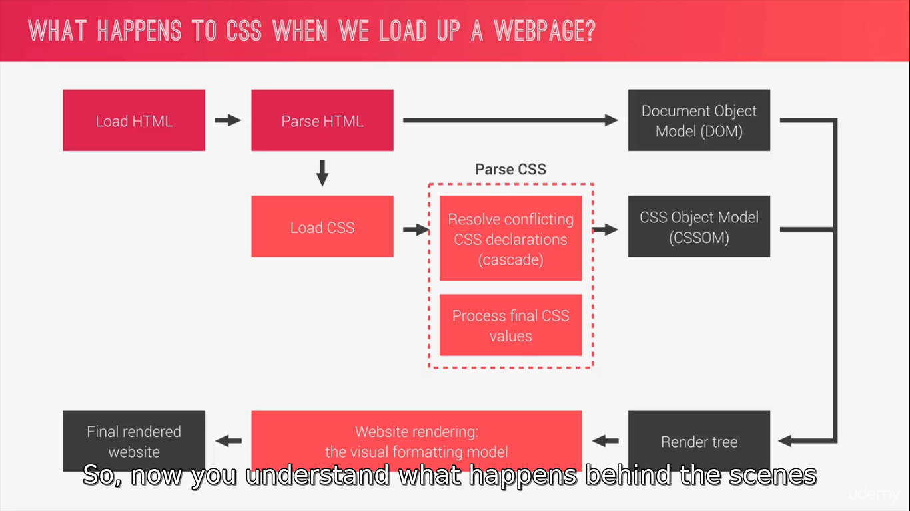

# outdoors
applying advance  CSS

## main point :
  - the best way to perform a basic reset using the universal selector.
  - set the project-wide font defenitions.
  - clip parts of elements using clip-path.

  -----

  we add the font proprtyes in bady selector not in the universal selector because the font's proprtyes are inheritance for all childes 

  the line height means in the font style that property specifies the height of a line.

  adding layer in the background using background-image with two proprtyes first one is liner-gradient which tack three parameters the position and the first color and the second color, and the next one is url to select the background image location

  adding padding in the body tag style will make a border for all the page .

  The clip-path CSS property creates a clipping region that sets what part of an element should be shown. Parts that are inside the region are shown, while those outside are hidden.

  if we wnat to make any box absolute to move it we need to make the parent posititon relative 

  when resizing the image just change the height and then the width will be automatically edited 

  span element is perfect to style some text differently so we can just put two spans or more in h1 

  they are two types of animations in css  the first one is to use transtion property and then change the propreties that you want to animate on an event  like when we hover the element, 
  the second one is to use the fram, start with write a keyframes and give it a name then , you can specify what I want to happen in each moment of the animation start with 0% which is before the animation actually starts and the finish will be 100% ,
  and to apply it , it need two properties to specify which the animation name and the animation duration 

  thire is a lettle shake after the animation finished so to solve this problem we need to add backface-visibility proprety to hidden in the parent element 

   pseudo class it's used to  style the element under a special condition 
   ex: .btn:link .btn:visited 

## Three Pillars of Writing Good HTML and CSS (Never Forget Them!)
  1- Responsive Design :
    - Fluid layouts.
    - Media queries
    - Responsive images
    - Correct units
    - Desktop-first vs mobile-first

  2- Maintainable and scalable code :
    - Clean
    - Easy-to-understand
    - Growth
    - Reudsble 
    - How to organize files
    - How to name classes
    - How to structure HTML

  3- Web performance :
    - Less HTTP requests
    - Less code
    - Compress code 
    - Use a CSS preprocessor
    - Less images 
    - Compress images 

## CSSOM(CSS Object Model) :
  when it's start to parse html file and find the css sheets includes in the html head and start loading them, and start to parse the css, but parsing css is bit more complex, there tow main steps first off, conflicting CSS declarations are resolved (cascade), and the second is to process final CSS values , and after all of this is done , the final CSS is also stored in a tree like structure called CSSOM, now DOM and CSSOM together form the Render Tree and it ready to render the page and to do that the browser used the Visual Formatting Model algorithm uses a bunch of stuff like the box modile, floats, and positioning , and finally after Visual Formating Modle has done it's work , the website it's finally renderd or painted to the screen 


## CSS rule : 
```
.my-class {
  color : blue;
}
```
we have many parts here : 

  1- .my-class : Selector.

  2- {...} : Declaration block.

  3- ```color: blue;```  :  Declaration.

  4- ```color``` : property.

  5- ```blue``` : Declaration.

## Cascade(the C in CSS) : 
  Process of combining different stylesheets and resolving confilcts between different CSS rules and declarations, when more than one rule applies to a certain element. 

  ### CSS come from different sources : 
    1-  author declarations (developer styles)
    2- user declarations (like if the user change the font size in the browser )
    3- defult browser declarations

  now the the cascade resolve conflicts by by look to the importance at the selector specificty and to source order 

  so 
  Importance  >> Specificity  >> Source order .  
  * Importance:(by order)                     
    1- User ```!important``` declarations.                     
    2- Author ```!important``` declaration.  
    3- Author declaration.    
    4- User declaration.  
    5- Defult browser declaration.  

(now alot of time we have a bunch of conflicting rules in author stylesheets without any important keyword this is actually the most common scenario in this case all declaration has the same importance thwn the cascade calculate and compare the specificities of the decloration selectors)
  * Specificity : (by order )   
    1- inline styles .  
    2- IDs.  
    3- Classes, pseudo-classes attribute.   
    4- Elements, pseudo-elemensts.  
  
  (the specificty is not just one number but one number for each of the four categories on evry selector (inline, IDs, Classes, Elements) Its works by looking to the order and how many appearances, and the the value of the winner called cascaded value ) 

  * Surce order : 
    if we have two elements have the exact same specifity , so in this case the last CSS declaration written in the code is the one that will apply

## Process Valuses in CSS : 
the declared values are process in six different steps starting form declared value to the final actual value , so : 
  1- Declared values : author declaration .  
  2- Cascaded values : after cascading .   
  3- Specified values: defulting if there is no cascaded value .  
  4- Computed value : converting relative values to absolute (cnvarted all words or units to relative values)  
  5- Used values : final calculations, based on layout (like the persantage valuse converted to px)  
  6- Actual value : browser and device restrictions.   

### how the CSS engine converts relative units to pixels : 
in order to calculate computed and used values 
  - first : for percentages :- 
    * ```for fonts : 150%``` : means that the element will have a font-size 150% larger than its parent element and it maybe the html or the body element .  
    * for lengths (height, padding, margin or something else) the reference is always the parent element's width .   
    ```padding : 10%``` : 0.10 * parent width px.   
  - second : for em : - 
  (both em and rem are fonts based )
    * for fonts 
    ```font-size: 3em;``` : the reference is simply the parent's computed font-size. 3em means three times the parent font size if the parent font-size is 24 px that means 3em equal 72px.  
    * for lengths (the em uses the font size of the current element as a reference)
    ```padding:2em``` : if the font-size for the element was 24px, the 2em will equal 48px.

  - third: for rem :-
  It actually works same way for both font sizes and lengths because it always just uses the root font size as a reference  
  ```padding : 10 rem``` : if the root font size was 16px, 10 rem will equal 160px .

#### why shuold we actually size things with em and rem if they based on font size ? 
by doing so we can build more requset responsive layouts, because just by changing the font sizes, we will automatically change length since it depend on a font size and that gives us a lot of flexibilty 

  - forth: vh and vw :- 
  these two are based on browser's view port 
  1 vw its just one percent of the view port width.   

so fainally notes : 
- Each property has an initial value, used if nothing is declared (and if there is no inheritance)  
- Browsers specify a root font size for each page (usually 16px)   
- Percentages and relative values are always converted to pixels.  
- Percentages are measured relative to their parent's font-size, if used to specify font-size;
- percentages are measured relative to their parent's width, if used to specify lengths ;   
- em are measured relative to their parent font-size, if used to specify font-size;   
- em are measured relative to the current font-size, if used to specify lengths;   
- rem are always measured relative to the document's root font-size;   
- vh and vw are simply percentage measurements of the viewport's height and width.


### Inheritance in CSS :
evry CSS property must have a value , 
so , is there a cascaded vluse ? if yes then specified value equal the cascaded value 
But if not then will look is the property inherited ? if yes then the specified value will equal the cascaded value of the parent element
ex: the parent has proprtey of line-height : 150% , and the child does not , and the line-height for parent equal 20px , then for the child will be 20px the calculated value .

so , 
  - Inheritance passes the values for some specific properties from parents to children (more maintainable code)  
  - Properties related to text are inherited : font-size, font-family, color, etc;   
  - The computed value of a property is what gets inherited, not the declared value;  
  - Inheritance of a property only works if no one declares a value for that property;  
  - The inherit Keyword forces inheritance on a certain property   
  - The initial keyword resets a property to initial value ;


## How visual formating modle work? :
**the visual formating modle** : Algorthm that calculates boxes and determine the layout of theses boxes, for each element in the render tree, in order to detrmine the final layout of the page . it depend on 
  - Dimentions of boxes : the box modle .
  - Box type: inline , block , inline-block .  
  - Positioning scheme : floats and positioning .  
  - stacking contexts .  
  - Other elements in the render tree.  

let start with the **Box Modle** : 
the box modle is without a doubt one of the most fundamental parts of CSS .
According to the box modle, each and every element on a webpage can be seen as a rectangle box and each box can have a width , a height , a padding , margins and borders 


**so lets break it down**
  - Content: text, img, etc.
  - padding : transoarent area around the content, inside of the box;   
  - Border : goes around the padding and the conent;   
  - Margen: space between the boxes;   
  - Fill area :area that gets filled with background color or background image;  

so if we want to claculate total width of the defult box modle it would be : 
**total width** = right border + right padding + specified width + left border + left padding;   
it's bunch of calculates and to solve this problem put the value of the box-sizing by border box 
so that the height and the width will be defined for the entire box including the padding and the border with the content area;
so now **total width** = specified width;   


**Box types** : 
  - Block level Box:
    * Elements formatted visually as block.
    * 100% of parent width.
    * Vertically , one after another 
    * Box-modle applies as shown 
    * 
    ```
    display : block
    display : flex
    display : list-item
    display : table
    ``` 
  
  - Inline box:
    * Content is distributed in lines.
    * Occupies only content's space
    * no line-breaks
    * no heights and widths
    * padding and margins only horizontal (left and right)
    * 
    ```
    display: inline
    ```
   
  - Inline block box: 
    * A mix of block and inline 
    * occupies only content's space 
    * No line-bracks
    * Box-modle applies as showed 
    * 
    ```
    display : inline-block
    ```

**Positioning Schames**
  - Normal flow 
    * Default positioning scheme;
    * NOT floates;
    * NOT absolutely positioned 
    * Elements laid out according to their source order ;
    ```
    default
    position : relative 
    ```

  - Floats
    * Element is removed form the normal flow ;
    * Text and inline elements will wrap around the floated element ;
    * The container will not adjust its height to the element;
    ```
    float: left 
    float: right
    ```

  - Absolute positioning 
    * Element is removed form the normal flow ;
    * No impact on surrounding content or elements;
    * We use ```top, bottom, left``` and ```right``` to offset the element from its relatively positioned container 

----
### introduction to Sass :- 

**Sass** : is a CSS preprocessor, an extension of CSS that adds power and elegance to the basic language 
we use sass to fix the problems that we have with CSS, CSS gets very messy, For each project ,having a single css file with thousands of lines of code without any reusable pieces , without any logic , gets completely unmanageable after some time .

**some fetures that Sass gives us**
  - Variables: for reusable values such as colors, font-size, spacing ,etc.
  - Nesting : to nest selectors inside of one another,allowing us to write less code .
  - operators : for mathematical operations right inside of CSS.
  - Partials and imports: to write in different files and importing them all into one single file ;
  - Mixins : to write reusable pieces of CSS code ;
  - Functions : similar to mixins, with the different that they produce a value that can be used;
  - Extends : to make different selctors inherit declarations that are common to all of them ;
  - Control directives : for writing complex code using conditionals and loop;

#### to run the sass in the project : 
  1- install node-sass  ```npm i node-sass -D```;  
  2- write a script to run sass compiler with with first with sass file then the distenation of css file that will produce from compiling so in script in package.json ```"compile:sass" : "node-sass sass/main.scss css/style.css"```;  
  3- when write sass and we need to compile it just run the script ```npm run compile:sass```;   

#### to write variable in sass : 
  $name-of-variable : value-of-variable;  
  and call it by $name-of-variable;  
  ex: 
  ```
  $color-dark : #000;
  background-color: #color-dark;
  ```
#### to write mixin: 
for example when we use float, we need prefix code to get the height of element that we float so we can write this piece of code as a mixin and use it wherever we want  
1- declar a mixin : (with name and block of declaration)  
```
@mixin clearfix {
  &::after {
    content: "";
    clear: both;
    display: table;
  }
}
```  
2- and we can call at many times like : 
in the place that we want that piece of code in it :  
```@include clearfix; ```;  
3- we can pass parameter to mixin :  
```
@mixin style-color($col) {
  background-color: $col;
}
```
4- and again call it put this time with passing argument :   
```@include style-color($color-dark)```;  

----

### architect our sass using 1-7 pattern :  
where we create siven folders and one main sass file to imrot all the files that are in these folders ,  
**note**: all partials start with underscore .   
  * base folder :(put our basic project definitions ) it will includes :   
    - _base.scss (includes resets and style for html and body elements selectors).  
    - _animation.scss.   
    - _typography.scss.   
    - _utilities.scss.   
  * abstracts folder (variabls, mixin and functions) :   
    - _variables.scss.   
    - _mixins.scss.   
    - _functions.scss.   
  * components folder (here create file for each component).   
  * layout folder : (elements should work every were and on all pages).   
  * pages folder : 
    - _home.scss. 

now we need to import all these files to main.scss file to work all of them togther 
so in main file 
**note** : when importing it's not neccessary to tell sass what is the extention or puting the underscore 
```
@import "abstracts/variables"  
... "the same for all files "
```
-----
* if we want to make gradient text background color for h2 for example :   
  1- in the stylesheet give it a background-image liner gradient with the colors.   
  2- display inline block to make the background just for text not the all width.   
  3- then use -webkit-background-clip to text;
  4- to make the clip show we need to make the text color to transparent.   
  5- using effect in hover state with malty effect so tranform : skewY(2) skewX(1) scale(1.1).  
  6- to make the text in the center we need to srround the h2 with a div and give it a class and this will be in utilities because we will need it more then one and make the align-text to center;

* makeimg a grid to disply the content in sections in parallel 
  1- create a div with class "row" thats the parent   
  2- and create two divs with the same class for the content   
  3- for the parent we will give it a max-width and background-color and margin 0 auto;   
  4- for the chidren apply prefix mixin for it 
  5- using [class^="col-"]{float :left } that mean rvery class starts with "col-" 
  6- and inside the class block using &:not(:last-child){margin-rgith:$gutter-horizintal} that mean all the class except the last one 
  ```
    [class^="col-"] {
    // background-color: orange;
    float: left;

    &:not(:last-child) {
      margin-right: $gutter-horizontal;
    }
  }
  ```
  